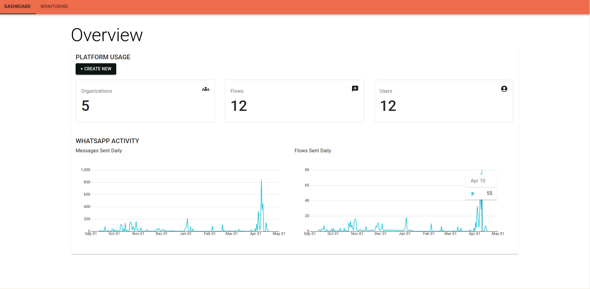

# AlixOps

### The Problem

Google Cloud (which we use as our cloud provider at Project Alix) offers comprehensive monitoring but sometimes it can be hard to find information thats actually relevant for our APIs and errors inside a stream of logs

### Solution

AlixOps is an internal dev tool that gives us a focused view into the health and errors of our platform, in near real-time. It streams just the logs, statuses and data we care about to a simplified dashboard.

### Tech Stack

The application consists of two main components:

- **Python Backend** (FastAPI): Handles data collection, service monitoring, authentication, and database operations
- **React Frontend** Provides a user interface for viewing monitoring data, statistics, and system status

